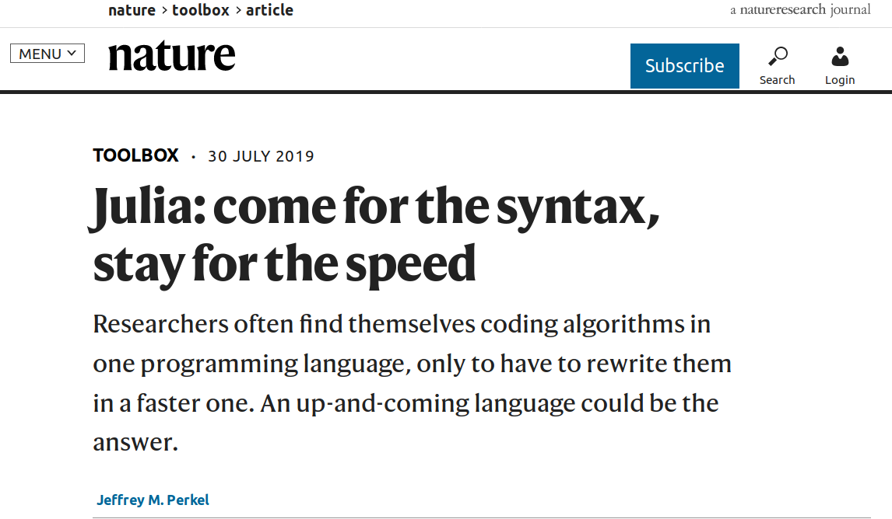
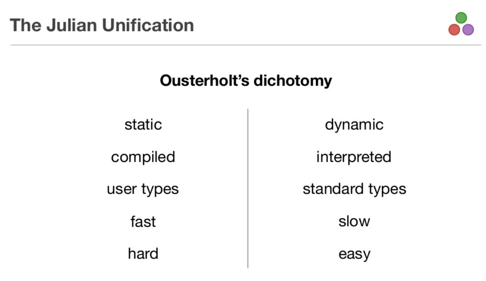
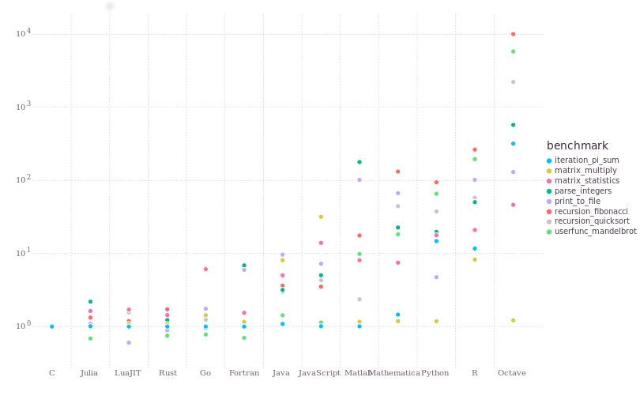
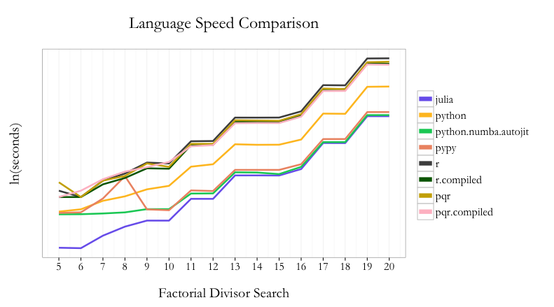
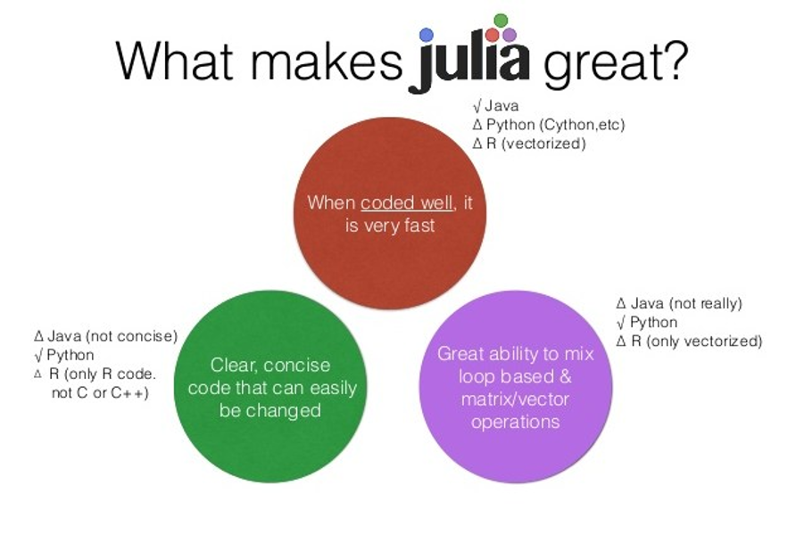
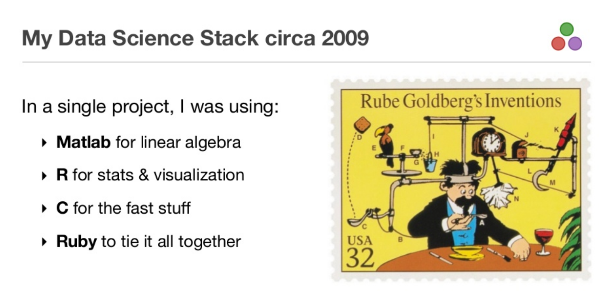
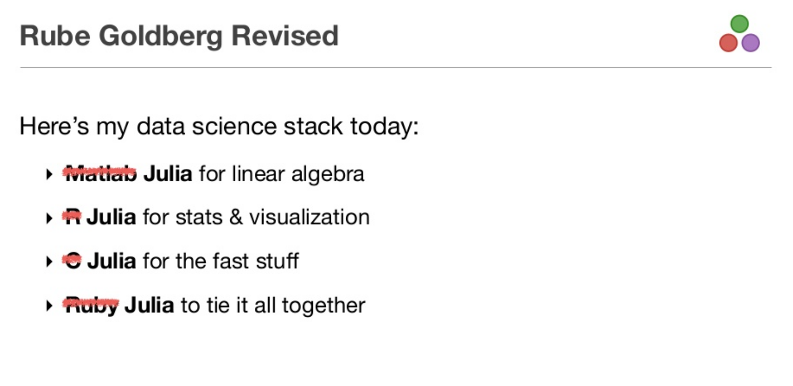
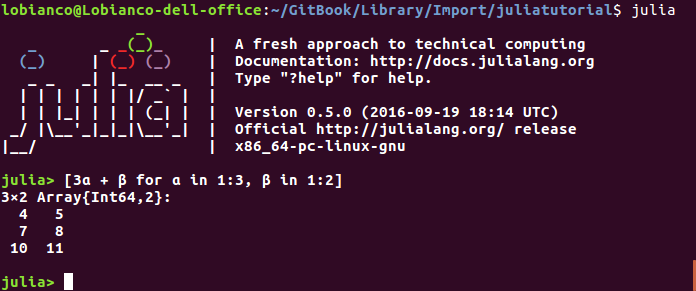
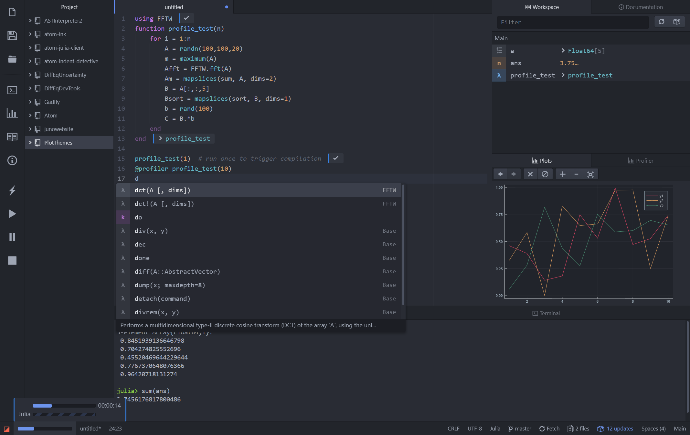
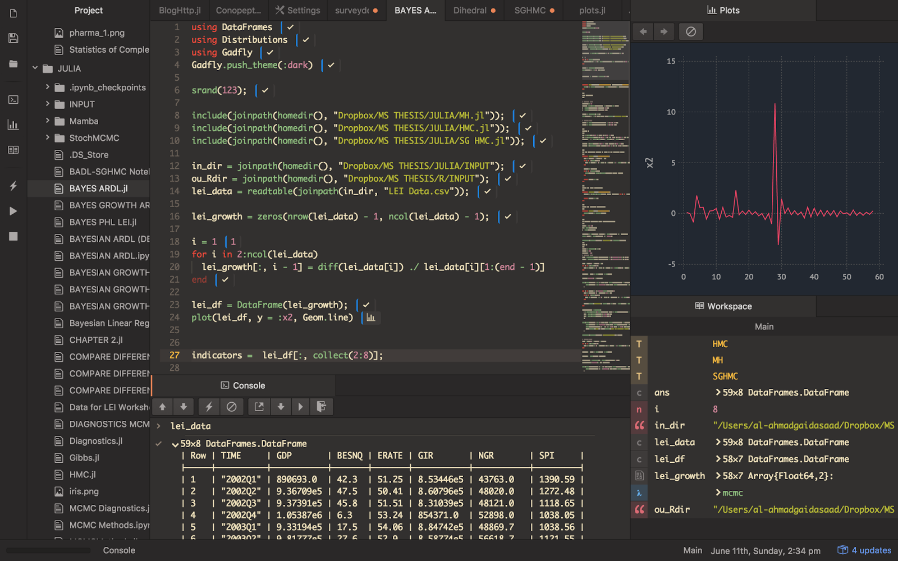

---
jupyter:
  jupytext:
    text_representation:
      extension: .md
      format_name: markdown
      format_version: '1.2'
      jupytext_version: 1.3.0
  kernelspec:
    display_name: Julia 1.2.0
    language: julia
    name: julia-1.2
---

```julia slideshow={"slide_type": "skip"}
using Revise
using BenchmarkTools
```

<!-- #region slideshow={"slide_type": "slide"} -->
# <center>Introducción a</center>
<center><a href="http://julialang.org/" target="_blank"></a>
<center><a href="http://julialang.org/" target="_blank">http://julialang.org/</a>


<!-- #endregion -->

<!-- #region slideshow={"slide_type": "fragment"} -->
### <center>Daniel Molina Cabrera</center> <br><center><a href="mailto:dmolina@decsai.ugr.es">dmolina@decsai.ugr.es</a></center>
<center><a href="https://github.com/dmolina/julia_presentacion">https://github.com/dmolina/julia_presentacion</a></center>
<!-- #endregion -->

<!-- #region slideshow={"slide_type": "slide"} -->
### Sobre mí

<center></center>

<div>
    <h4>Profesor de Dpto Ciencias de la Computación e Inteligencia Artificial</h4>
    <h3>Intereses</h3>
    <ul>
        <li>Meta-heurísticas</li>
        <li>Machine Learning</li>
        <li>Desarrollo de Software</li>
    </ul>
</div>
<!-- #endregion -->

<!-- #region slideshow={"slide_type": "slide"} -->
### Sobre mí

<center></center>

<div>
    <h4>Convencido del Software Libre</h4>
    <h3>Intereses <em>frikis</em></h3>
    <ul>
        <li>Linuxero convencido.</li>
        <li>Aficionado a Emacs.</li>
        <li><em>Pythonero</em> y últimamente <em>Julianero</em></li>
    </ul>
</div>
<!-- #endregion -->

<!-- #region slideshow={"slide_type": "slide"} -->
# ¿Qué es Julia?
<!-- #endregion -->

<!-- #region slideshow={"slide_type": "subslide"} -->
# Motivación de Julia en 2009

> We want a language that’s **open source**, with a liberal license. We want **the speed of C** with the **dynamism of Ruby**. We want a language that’s homoiconic, with true macros like Lisp, but with obvious, **familiar mathematical notation like Matlab**. We want something as usable for **general programming as Python**, **as  easy for statistics as R**, as natural for string processing as Perl, as **powerful for linear algebra as Matlab**, as good at gluing programs together as the shell. Something that is dirt simple to learn, yet keeps the most serious hackers happy. We want it **interactive** and we want **it compiled**.

> (Did we mention it should be as fast as C?)
<!-- #endregion -->

<!-- #region slideshow={"slide_type": "subslide"} -->
# Por tanto

- Es un Lenguaje Software Libre. 
- De propósito general, pero hecho por y para científicos. 
- Eficiente (no interpreta las funciones, las compila y ejecuta).
- Muy similar a Python.

<!-- #endregion -->

<!-- #region slideshow={"slide_type": "subslide"} -->
# Código en Python _vs_ Julia
```python
def fib(n):
    if n <= 1:
        return 1
    else:
        return fib(n-1)+fib(n-2)
    
%time fib(40)```

<!-- #endregion -->

```julia
function fib(n)
    if n ≤ 1
        1
    else
        fib(n-1)+fib(n-2)
    end
end
@time fib(40)
@time fib(40)
```

<!-- #region slideshow={"slide_type": "subslide"} -->

<center></center>
<!-- #endregion -->

<!-- #region slideshow={"slide_type": "slide"} -->
# Evolución de Julia
<!-- #endregion -->

<!-- #region slideshow={"slide_type": "subslide"} -->
# Origen de Julia

- Desarrollado por varios estudiantes de Doctorado del MIT desde 2009, primera versión pública en 2012.
- Versión 1.0 en Agosto de 2018.
    - Más de 2 millones de descargas, estimado medio millón de usuarios habituales.
    - 750 han subido commit (yo incluído).
    - +2400 paquetes, algunos de mucha calidad.
<!-- #endregion -->

<!-- #region slideshow={"slide_type": "subslide"} -->
# Recientes Hitos de Julia

- Sistema de Paquetes a Final de 2018.
- Reescrito depurador en 2019.
<!-- #endregion -->

<!-- #region slideshow={"slide_type": "fragment"} -->
# Futuros cambios

- Versión 1.3 con mejor soporte de hebras (Release).
- Mejorar la carga de librerías en Versión 1.4.
- Permitir crear ejecutables.
<!-- #endregion -->

<!-- #region slideshow={"slide_type": "slide"} -->
# Motivo de Julia

<!-- #endregion -->

<!-- #region slideshow={"slide_type": "fragment"} -->
## Evitar el problema del doble lenguaje

- Uno sencillo para flexibilidad, pero lento. 
- Uno complejo pero rápido.
<!-- #endregion -->

<!-- #region slideshow={"slide_type": "subslide"} -->
<center> </center>
<!-- #endregion -->

<!-- #region slideshow={"slide_type": "subslide"} -->
# No tiene por qué ser asi
<!-- #endregion -->

<!-- #region slideshow={"slide_type": "subslide"} -->
### <center>Algunos Benchmarks</center>

<center></center>
<!-- #endregion -->

<!-- #region slideshow={"slide_type": "subslide"} -->
# Resultados

<center></center>

Fuente: https://randyzwitch.com/python-pypy-julia-r-pqr-jit-just-in-time-compiler/

<!-- #endregion -->

<!-- #region slideshow={"slide_type": "subslide"} -->
<center></center>
<!-- #endregion -->

<!-- #region slideshow={"slide_type": "subslide"} -->
# El objetivo es simplificar la vida
<!-- #endregion -->

<!-- #region slideshow={"slide_type": "subslide"} -->
<center> </center>
<!-- #endregion -->

<!-- #region slideshow={"slide_type": "subslide"} -->
<center> </center>
<!-- #endregion -->

<!-- #region slideshow={"slide_type": "subslide"} -->
# Mi caso es parecido

- Trabajo en Metaheurísticas en problemas complejos.
- La mayoría usa Matlab, yo Python.
<!-- #endregion -->

<!-- #region slideshow={"slide_type": "fragment"} -->
## Ejecutando código externo

- Pasado en Matlab, problemas de licencia.
- Ejecutar en Octave supone tardar mucho más. 
- Pasarlo a Python es conflictivo:
    - Sintaxis distinta.
    - Posibles problemas: En Matlab índices desde 1, en Python por 0. 
    - En Python es necesario usar numpy, sintaxis más alejada de Matlab.
<!-- #endregion -->

<!-- #region slideshow={"slide_type": "subslide"} -->
### Proceso de mis algoritmos

- Python para prototipado.
- Numpy para rendimiento.
- Evitar condiciones, usar operaciones vectorizadas.
- Identificar cuellos de botella.
- A veces C++ para reimplementar esas partes (Cython).

<!-- #endregion -->

<!-- #region slideshow={"slide_type": "fragment"} -->
### Usando Julia

- No es necesario Numpy ni cython.
- Librerías sólo disponibles en Python usando PyCall.
- Más fácil llamar código C/C++ que desde Python.
<!-- #endregion -->

<!-- #region slideshow={"slide_type": "slide"} -->
# Comparando Julia con Python
<!-- #endregion -->

<!-- #region slideshow={"slide_type": "subslide"} -->
## Semejanzas

- Sintaxis muy similar.
- Entorno Interactivo (REPL) como IPython.
<!-- #endregion -->

<!-- #region slideshow={"slide_type": "fragment"} -->
<center></center>

<!-- #endregion -->

<!-- #region slideshow={"slide_type": "fragment"} -->
- Modo Julia, por defecto.
- Modo Package \[, para buscar y gestionar paquetes.
- Modo Shell \; para ejecutar comandos.

Vamos a verlo.
<!-- #endregion -->

<!-- #region slideshow={"slide_type": "subslide"} -->
# Repositorio Oficial de Paquetes
<!-- #endregion -->

```julia slideshow={"slide_type": "fragment"}
using Pkg
Pkg.add("OhMyREPL")
```

```julia slideshow={"slide_type": "fragment"}
using OhMyREPL
```

<!-- #region slideshow={"slide_type": "subslide"} -->
# Más semejanzas con Python

- Uso de paquetes, importa con **import** o con **using**. 
- Sistema de tests automáticos.
<!-- #endregion -->

```julia
import Distributions
rand(Distributions.Uniform(-5, 5), 3)
```

```julia
using Distributions: Uniform 
rand(Uniform(-5, 5), 3)
```

```julia
using Distributions
rand(Uniform(-5, 5), 3)
```

<!-- #region slideshow={"slide_type": "subslide"} -->
# Semejanzas en la sintaxis

- No hace falta definir variables.
- Vectores son referencias.
- Manejo de iteradores (for, enumerate, zip, ...). 
- Uso de funciones lambda. 
<!-- #endregion -->

```julia
var = [1 2 3]
println(var)
var = 3
println(var)
filter(x->x[end]=='2', ["usuario$i" for i in 1:3])
```

<!-- #region slideshow={"slide_type": "subslide"} -->
# Estructuras de Datos en el lenguaje

- Arrays, dentro del propio lenguaje.
- String, UTF-8.
- Diccionarios.
- Conjuntos.
<!-- #endregion -->

```julia
valores = ["hola", "adios"];
dict = Dict(i=>val for (i, val) in enumerate(valores))

for (k,v) in dict
    println(k, v)
end
```

```julia
println(keys(dict))
```

```julia
collect(Set([1, 2, 4, 2, 4]))
```

<!-- #region slideshow={"slide_type": "subslide"} -->
# Diferencias en la sintaxis

- _def_ => _function_ (como Matlab).
- No usa tabulador para distinguir, usa **end**. 
- Lo bueno es que no tiene begin, y el _end_ es reducido (no antes de un else, por ejemplo).
<!-- #endregion -->

```julia
function fibo(n::Int)
    (a, b) = (1, 1)
    
    for _ in 1:n-1
        (a, b) = (a+b, a)   
        end
    a
end
@time @show fibo(40)
```

<!-- #region slideshow={"slide_type": "subslide"} -->
# Tipos opcionales
- No es necesario, él deduce cuando se llama al método.
- Existen tipos genéricos, útiles para evitar errores (Int, Float, Real, Number, AbstractString, ...).
<!-- #endregion -->

```julia
sphere(x)= sum(x.^2)
sphere(3)
```

```julia
sphere([3, 4, 5])
```

<!-- #region slideshow={"slide_type": "subslide"} -->
# Es eficiente porque se compila según el tipo concreto
<!-- #endregion -->

```julia
@code_warntype sphere([3, 4, 5])
```

<!-- #region slideshow={"slide_type": "subslide"} -->
# Es eficiente porque se compila según el tipo concreto
<!-- #endregion -->

```julia
fabsurda(x)=x^2+3;  
```

```julia
@code_warntype fabsurda(3)
```

```julia slideshow={"slide_type": "subslide"}
@code_warntype fabsurda(1//3)
```

```julia slideshow={"slide_type": "fragment"}
@code_llvm fabsurda(3)
```

<!-- #region slideshow={"slide_type": "subslide"} -->
# Diferente inicio del índice
Empieza en 1, no en 0. 
- No es tan problemático, se suele usar iterador y/o enumerate.
<!-- #endregion -->

```julia
valores = ["Uno", "Dos", "Tres"]

for i = 1:length(valores)
    println("$i: ", valores[i])
end
println("-"^8)
for val in valores
    println(val)
end
for (i, val) in enumerate(valores)
    println("$i: $val")
end
```

<!-- #region slideshow={"slide_type": "subslide"} -->
# Modelo Funcional, no Orientado a Objetos

- Los paquetes definen structuras y funciones sobre ellas.
- Usando jerarquías de tipos se puede reutilizar código.
- El Multiple Dispatch (redefinir métodos).
    - Interfaz Table usado por múltiples implementaciones (DataFrames, ...).
- Interfaz funcional.
- Operador |> Permite encadenar operaciones.
<!-- #endregion -->

```julia
msg = "Hola"
println(uppercase(msg))
msg |> uppercase |> println
```

```julia slideshow={"slide_type": "subslide"}
struct MyData
    n::Int64
    s::String
end

using Base: println

function Base.println(io::IO, v::MyData)
    println(io, "Mi println: ", string(v.n), ": ", v.s)
end

data = MyData(4, "Hola")
println(data)
@show methods(println)
@show methodswith(typeof(data))
```

<!-- #region slideshow={"slide_type": "subslide"} -->
# Operador Punto

- Permite vectorizar cualquier función. 
- Permite operaciones más eficientes.
<!-- #endregion -->

```julia
op(x) = x*x-5
@show op.([1,2,3, 4, 5, 6, 7])
# println.(op.([1, 2, 4]));
```

<!-- #region slideshow={"slide_type": "subslide"} -->
# Ejemplo más complejo
<!-- #endregion -->

```julia
A = rand(Uniform(-5, 5), 3000); B = rand(Uniform(-5, 5), 3000); 
```

```julia
C = similar(A);
function add1!(C, A, B)
    C .= A .+ B
end
@btime add1!(C, A, B);
```

```julia
add2!(C, A, B) = @. C = A+B
@btime add2!(C, A, B);
```

```julia
function add3!(C, A, B)
@inbounds @simd for i in 1:length(A)
    C[i] = A[i]+B[i]
    end
end

@btime add3!(C, A, B)
```

<!-- #region slideshow={"slide_type": "subslide"} -->
# Uso de ficheros

<!-- #endregion -->

```julia
users = ["Estudiante$(elem)" for elem in 1:2:8]
```

```julia
open("usuarios.txt", "w") do file
    for user in users
        println(file, user)
    end
end
```

```julia
open("usuarios.txt") do file
    for line in readlines(file)
        println(strip(line))
    end
end
```

<!-- #region slideshow={"slide_type": "subslide"} -->
# Comunicación con otros lenguajes

- Comunicación con Python/R/C++.
<!-- #endregion -->

```c
// Código en libsaludo.so
#include <stdio.h>

char msg[80];

char *getname(int num) {
  sprintf(msg, "Hola a los %d asistentes", num);
  return msg;
}
```

<!-- #region slideshow={"slide_type": "subslide"} -->
## Llamando al código C/C++

Se compila como librería .so, y luego se puede llamar desde Julia.
<!-- #endregion -->

```julia
using Libdl
lib_ptr = dlopen("./libsaludo.so")
get_name = dlsym(lib_ptr, "getname")
result = ccall(get_name, Cstring, (Cint, ), 16)
println(unsafe_string(result))
```

<!-- #region slideshow={"slide_type": "subslide"} -->
# Llamando a código Python
<!-- #endregion -->

```julia
using PyCall
math=pyimport("math")
println(math.sin(3)) # Llama a función sin de math
np=pyimport("numpy")
np.random.rand(5) # Convierte al tipo array de Julia
```

<!-- #region slideshow={"slide_type": "subslide"} -->
# Modo de Ayuda

Uso de cadenas descriptivas para cada función. 
<!-- #endregion -->

```julia
"""
Esta función permite calculo el número de fibonacci.

n: Entero del cual calcular fibonacci.
"""
function fibo(n::Int)
    (a, b) = (1, 1)
    
    for _ in 1:n-1
        (a, b) = (a+b, a)
    end
    a
end
@time @show fibo(40)
```

```julia slideshow={"slide_type": "subslide"}
?fibo
```

<!-- #region slideshow={"slide_type": "subslide"} -->
# Flexible

## Se puede personalizar
<!-- #endregion -->

```julia
"a" in "hola"
```

```julia
using Base: in

Base.in(a::AbstractString, b::AbstractString) = occursin(a, b)

"a" in "hola"
```

<!-- #region slideshow={"slide_type": "subslide"} -->
## Macros

- Empiezan por @.
- Permiten generar código.

<!-- #endregion -->

```julia
macro load(x) # using a veces tarda, creo una macro para sólo hacerlo si no está ya en memoria
    if !(x in names(Main, all=false, imported=true))
        return :(using $x)
    end
end

@time using OhMyREPL
@time @load OhMyREPL
```

Se puede construir fácilmente la documentación, Paquete [Documenter.jl](https://juliadocs.github.io/Documenter.jl/stable/):
- Usa Markdown para describirlo para los usuarios.
- Permite añadir la documentación del API. 
- Tests como documentación.

<!-- #region slideshow={"slide_type": "slide"} -->
# Comunidad Científica

Librerías/Paquetes populares en: [https://pkg.julialang.org/docs/](https://pkg.julialang.org/docs/)

- Notebook: [IJulia](https://pkg.julialang.org/docs/IJulia/nfu7T/1.20.2/)
- Científico: [QueryVerse](https://www.queryverse.org/)
    - Librería DataFrames: [DataFrames.jl](https://github.com/JuliaData/DataFrames.jl)
    - Visualización: [VegaLite](https://www.queryverse.org/VegaLite.jl/stable/)
- Visualización: [Gadfly](https://gadflyjl.org/stable/tutorial/), [Plots](https://docs.juliaplots.org/latest/tutorial/#tutorial-1), [StatsPlots](https://github.com/JuliaPlots/StatsPlots.jl)
- Librerías de Deep Learning: [Flux.jl](https://fluxml.ai/), [KNet.jl](https://github.com/denizyuret/Knet.jl).
- Machine Learning: [ScikitLearn.jl](https://github.com/cstjean/ScikitLearn.jl), [MLJ](https://pkg.julialang.org/docs/MLJ/rAU56/0.5.4/) 

<!-- #endregion -->

<!-- #region slideshow={"slide_type": "subslide"} -->
# Comunidad científica

## Librerías del Estado del Arte
- Librería de optimización: [JuMP](https://pkg.julialang.org/docs/JuMP/DmXqY/0.20.1/quickstart.html#Quick-Start-Guide-1)
- Ecuaciones Diferenciales: [DifferentialEquations](https://docs.juliadiffeq.org/latest/)
- Librerías estadística: [Distributions](https://juliastats.org/Distributions.jl/latest/starting/)

## Más genéricas
- Páginas web: [Genie](https://genieframework.github.io/Genie.jl/)
- Base de Datos: [Octo](https://github.com/wookay/Octo.jl)
<!-- #endregion -->

<!-- #region slideshow={"slide_type": "slide"} -->
# IDEs

- Juno: Atom con los paquetes de Julia pre-instalados.

- Visual Code.

- SublimeText.

- Emacs.
<!-- #endregion -->

<!-- #region slideshow={"slide_type": "subslide"} -->
# <center>Juno</center>

<center></center>
<!-- #endregion -->

<!-- #region slideshow={"slide_type": "subslide"} -->
# <center>Visual Code</center>

<center></center>
<!-- #endregion -->

<!-- #region slideshow={"slide_type": "slide"} -->
# Otras ventajas de Julia

- Notación matemática.
<!-- #endregion -->

```julia
fun_mat(x; α=0.5)=3α+2x
    
fun_mat(3, α=0.1)
```

- Más fácil de general paquete oficial que pip.
    - Creado desde pkg, recomendable usar PkgTemplate.jl
- Criterios razonables, los métodos que cambian atributos terminan con "!".

<!-- #region slideshow={"slide_type": "subslide"} -->
# Consejos sobre Julia

- Cargar la librería es costoso. 
    - Cargar una vez, y luego cargar con include las funciones. 
    - Usar paquete Revise que permite recargar los ficheros modificados.
- Que las variables no cambien de tipo.
- No usar [], si no Tipo[].
<!-- #endregion -->

```julia
a = []
push!(a, 3)
@show typeof(a)
b = Int[]
push!(b, 3)
@show typeof(b);
```

<!-- #region slideshow={"slide_type": "subslide"} -->
# Consejos sobre Julia

- Leer documentación, adaptarse al lenguaje.
- Documentar funciones propias, y ser claro.
- Usar parámetros sólo por seguridad (tipos genéticos), no abusar.
- Usar paquetes, dependencias claras.
- Evita variables globales, sólo constantes (palabra **const**).
- Usar funciones, incluso una main().
<!-- #endregion -->

<!-- #region slideshow={"slide_type": "subslide"} -->
# Desventajas de Julia

- Gran latencia al compilar (como Tiempo para cargar librerías, y mostrar la primera gráfica).
- Falta de madurez en librerías (falta documentación). 
- Falta compilación estática.
- Muy enfocado al entorno científico, faltan librerías genéricas.
- Union de tipos costoso.
- Malos mensajes de error.


<!-- #endregion -->

<!-- #region slideshow={"slide_type": "slide"} -->
<center></center>
<center><h2>Muchas gracias por la atención</h2></center>
<br><center>danimolina@gmail.com</center>
<center><a href="https://github.com/dmolina/julia_presentacion">https://github.com/dmolina/julia_presentacion</a></center>
<!-- #endregion -->
