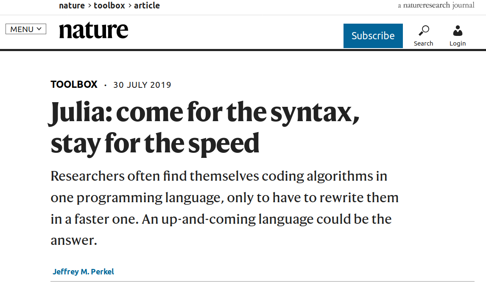
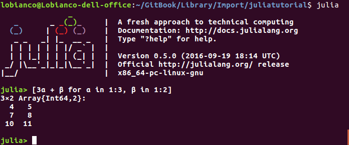
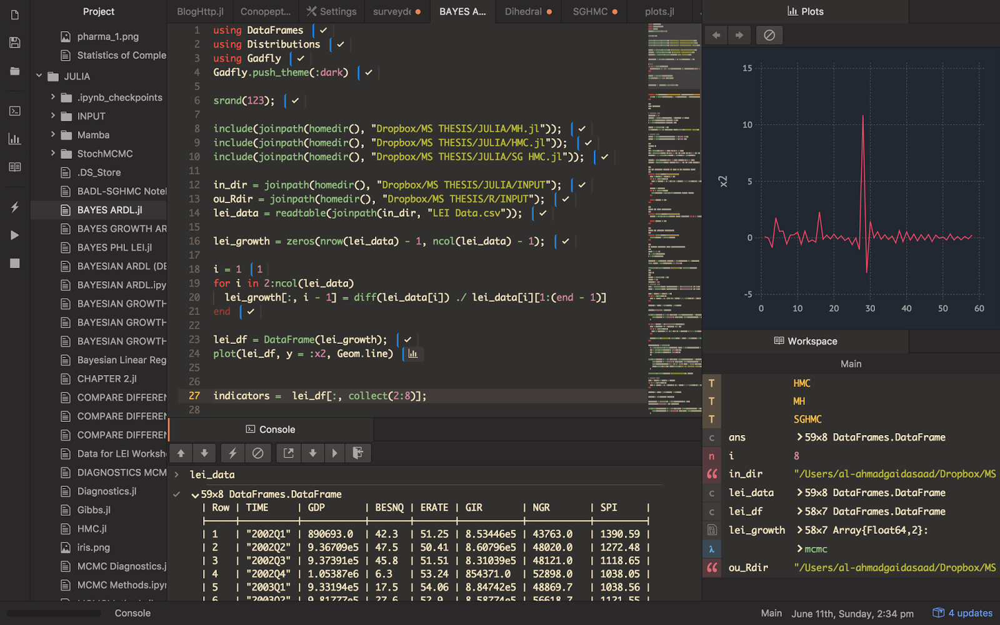

---
jupyter:
  jupytext:
    formats: ipynb,md
    text_representation:
      extension: .md
      format_name: markdown
      format_version: '1.2'
      jupytext_version: 1.3.0
  kernelspec:
    display_name: Julia 1.3.0
    language: julia
    name: julia-1.3
---

```julia slideshow={"slide_type": "skip"}
using Revise
using BenchmarkTools
```

<!-- #region slideshow={"slide_type": "slide"} -->
# <center>Introduction to</center>
<center><a href="http://julialang.org/" target="_blank"></a>
<center><a href="http://julialang.org/" target="_blank">http://julialang.org/</a>


<!-- #endregion -->

<!-- #region slideshow={"slide_type": "fragment"} -->
### <center>Daniel Molina Cabrera</center> <br><center><a href="mailto:dmolina@decsai.ugr.es">dmolina@decsai.ugr.es</a></center>
<center><a href="https://github.com/dmolina/julia_presentacion">https://github.com/dmolina/julia_presentacion</a></center>
<!-- #endregion -->

<!-- #region slideshow={"slide_type": "slide"} -->
### About me

<center></center>

<div>
    <h4>Assistant professor at Computer Science and Artificial Intelligence, University of Granada (Spain)</h4>
    <h3>Interests</h3>
    <ul>
        <li>Metaheuristics</li>
        <li>Machine Learning</li>
        <li>Software Development</li>
    </ul>
</div>
<!-- #endregion -->

<!-- #region slideshow={"slide_type": "slide"} -->
### About me

<center></center>

<div>
    <h4>Free Software supporter.</h4>
    <h3>Several <em>frikis</em> interests</h3>
    <ul>
        <li>Linux user (not Windows).</li>
        <li>Emacs.</li>
        <li><em>Pythonic</em> and lastly <em>Julian</em></li>
    </ul>
</div>
<!-- #endregion -->

<!-- #region slideshow={"slide_type": "slide"} -->
# What is Julia?
<!-- #endregion -->

<!-- #region slideshow={"slide_type": "subslide"} -->
# Julia Motivation in 2009

> We want a language that’s **open source**, with a liberal license. We want **the speed of C** with the **dynamism of Ruby**. We want a language that’s homoiconic, with true macros like Lisp, but with obvious, **familiar mathematical notation like Matlab**. We want something as usable for **general programming as Python**, **as  easy for statistics as R**, as natural for string processing as Perl, as **powerful for linear algebra as Matlab**, as good at gluing programs together as the shell. Something that is dirt simple to learn, yet keeps the most serious hackers happy. We want it **interactive** and we want **it compiled**.

> (Did we mention it should be as fast as C?)
<!-- #endregion -->

<!-- #region slideshow={"slide_type": "subslide"} -->
# So

- It is a Free Software Language (not as Matlab).
- For general proposed, but done by and for researchers.
- Very efficient (functions are compiled and later not, not interpreted).
- Very similar to Python (and to Matlab) in the good things.

<!-- #endregion -->

<!-- #region slideshow={"slide_type": "subslide"} -->
# Python Code _vs_ Julia Code
```python
def fib(n):
    if n <= 1:
        return 1
    else:
        return fib(n-1)+fib(n-2)
    
%time fib(40)```

<!-- #endregion -->

```julia
function fib(n)
    if n ≤ 1
        1
    else
        fib(n-1)+fib(n-2)
    end
end
@time fib(40)
@time fib(40)
```

<!-- #region slideshow={"slide_type": "subslide"} -->

<center></center>
<!-- #endregion -->

<!-- #region slideshow={"slide_type": "slide"} -->
# Julia Evolution
<!-- #endregion -->

<!-- #region slideshow={"slide_type": "subslide"} -->
# Julia Origin

- Developed by several Phd students in MIT since 2009, first public version in 2012.
- Version 1.0 in August 2018.
    - More than 2 millions of downloads.
    - 750 have committed (me included).
    - +2400 libraries, some of them with a high quality.
<!-- #endregion -->

<!-- #region slideshow={"slide_type": "subslide"} -->
# Recent Julia events

- New package system at the end of 2018.
- New debugger in 2019.
<!-- #endregion -->

<!-- #region slideshow={"slide_type": "fragment"} -->
# Expected changes

- Version 1.3 with better support of threads.
- Improve the time loading libraries in version 1.4.
- In a future to create binaries.
<!-- #endregion -->

<!-- #region slideshow={"slide_type": "slide"} -->
# Julia Reason of existence

<!-- #endregion -->

<!-- #region slideshow={"slide_type": "fragment"} -->
## Avoid the two-languages problem

- One simple for flexibility but slow (as Python).
- One complex but quickly. 
<!-- #endregion -->

<!-- #region slideshow={"slide_type": "subslide"} -->
<center> </center>
<!-- #endregion -->

<!-- #region slideshow={"slide_type": "subslide"} -->
# It can be different
<!-- #endregion -->

<!-- #region slideshow={"slide_type": "subslide"} -->
### <center>Some Benchmarks</center>

<center></center>
<!-- #endregion -->

<!-- #region slideshow={"slide_type": "subslide"} -->
# Results

<center></center>

Source: https://randyzwitch.com/python-pypy-julia-r-pqr-jit-just-in-time-compiler/

<!-- #endregion -->

<!-- #region slideshow={"slide_type": "subslide"} -->
<center></center>
<!-- #endregion -->

<!-- #region slideshow={"slide_type": "subslide"} -->
# The aim is to simplify our life
<!-- #endregion -->

<!-- #region slideshow={"slide_type": "subslide"} -->
<center> </center>
<!-- #endregion -->

<!-- #region slideshow={"slide_type": "subslide"} -->
<center> </center>
<!-- #endregion -->

<!-- #region slideshow={"slide_type": "subslide"} -->
# My case is similar

- I work in metaheuristics in complex problems.
- The majority uses Matlab, I use Python.
<!-- #endregion -->

<!-- #region slideshow={"slide_type": "fragment"} -->
## Running shared code

- Usually I receive code of other algorithms in Matlab, license problems to run them.
- Run them in Octave means to take a lot of time running. 
- Traslate the code to Python is not easy:
    - Different Syntax.
    - Sources of problems: In Matlab indexes start with 1, while in Python with 0.
    - In Python is needed to use numpy, syntax even further of original Matlab.
<!-- #endregion -->

<!-- #region slideshow={"slide_type": "subslide"} -->
### For my algorithms

- Python for prototype.
- Numpy for performance.
- Avoid conditionals, try to use vectored operations, even when there are more complex to understand.
- Identify bottlenecks.
- Sometimes use C++ for re-implementing the slowest components (Cython).

<!-- #endregion -->

<!-- #region slideshow={"slide_type": "fragment"} -->
### Using Julia

- It is not needed neither Numpy neither cython.
- Libraries only availables are Python using PyCall. 
- Easier to call C/C++ code than from Python. 
<!-- #endregion -->

<!-- #region slideshow={"slide_type": "slide"} -->
# Comparing Julia with Python
<!-- #endregion -->

<!-- #region slideshow={"slide_type": "subslide"} -->
## Similarities

- Very similar syntax.
- Interactive mode (REPL) similar to IPython.
<!-- #endregion -->

<!-- #region slideshow={"slide_type": "fragment"} -->
<center></center>

<!-- #endregion -->

<!-- #region slideshow={"slide_type": "fragment"} -->
- Julia mode, by default.
- Package mode \[, for searching and managing packages.
- Shell Mode \; for running commands.

Let's go to see them.
<!-- #endregion -->

<!-- #region slideshow={"slide_type": "subslide"} -->
# Official Packages Repository 
<!-- #endregion -->

```julia slideshow={"slide_type": "fragment"}
using Pkg
Pkg.add("OhMyREPL")
```

```julia slideshow={"slide_type": "fragment"}
using OhMyREPL
```

<!-- #region slideshow={"slide_type": "subslide"} -->
# More similarities

- Packages usage, import with **import** o with **using**. 
- Automatic tests system.
<!-- #endregion -->

```julia
import Distributions
rand(Distributions.Uniform(-5, 5), 3)
```

```julia
using Distributions: Uniform 
rand(Uniform(-5, 5), 3)
```

```julia
using Distributions
rand(Uniform(-5, 5), 3)
```

<!-- #region slideshow={"slide_type": "subslide"} -->
# More similarities

- It is not need to declare variables.
- Vectors.
- Iterators (for, enumerate, zip, ...).
- Lambda functions.
<!-- #endregion -->

```julia
var = [1 2 3]
println(var)
var = 3
println(var)
filter(x->x[end]=='2', ["user$i" for i in 1:3])
```

<!-- #region slideshow={"slide_type": "subslide"} -->
# Data Structures in the language

- Arrays, inside the lenguaje.
- String, UTF-8.
- Dictionaries.
- Sets
<!-- #endregion -->

```julia
valores = ["hello", "bye!"];
dict = Dict(i=>val for (i, val) in enumerate(valores))

for (k,v) in dict
    println(k, v)
end
```

```julia
println(keys(dict))
```

```julia
collect(Set([1, 2, 4, 2, 4]))
```

<!-- #region slideshow={"slide_type": "subslide"} -->
# Differences in the syntax

- _def_ => _function_ (as Matlab).
- No use tab for separate, it uses **end**. 
- The good thing is has not not begin, and _end_ is limited (not before an else, for instance).
<!-- #endregion -->

```julia
function fibo(n::Int)
    (a, b) = (1, 1)
    
    for _ in 1:n-1
        (a, b) = (a+b, a)   
        end
    a
end
@time @show fibo(40)
```

<!-- #region slideshow={"slide_type": "subslide"} -->
# Optional typing
- It is not needed, Julia deduces theme when you call the function.
- There are generic types, usefuls for avoid errors (Int, Float, Real, Number, AbstractString, ...).
<!-- #endregion -->

```julia
sphere(x)= sum(x.^2)
sphere(3)
```

```julia
sphere([3, 4, 5])
```

<!-- #region slideshow={"slide_type": "subslide"} -->
# It is efficient because it can compile for each concrete type
<!-- #endregion -->

```julia
@code_warntype sphere([3, 4, 5])
```

<!-- #region slideshow={"slide_type": "subslide"} -->
# It is efficient because it can compile for each concrete type
<!-- #endregion -->

```julia
fabsurda(x)=x^2+3;  
```

```julia
@code_warntype fabsurda(3)
```

```julia slideshow={"slide_type": "subslide"}
@code_warntype fabsurda(1//3)
```

```julia slideshow={"slide_type": "fragment"}
@code_llvm fabsurda(3)
```

<!-- #region slideshow={"slide_type": "subslide"} -->
# Working with indexes
- Index starts with 1, not 0. 
- It is not so probelmatic, anyway it is very common to use iterator and/or enumerate: 
<!-- #endregion -->

```julia
values = ["One", "Two", "Three"]

for i = 1:length(values)
    println("$i: ", values[i])
end
println("-"^8)
for val in values
    println(val)
end
for (i, val) in enumerate(values)
    println("$i: $val")
end
```

<!-- #region slideshow={"slide_type": "subslide"} -->
# Functional, not Object Oriented

- Packages define structs and functions using them. 
- Multiple Dispatch:
    - Not cost. 
    - Example: Table interface used by multiple implementations (DataFrames, ...).
- Functional interface.
- Operator |> to concat operations.
<!-- #endregion -->

```julia
msg = "Hello"
println(uppercase(msg))
msg |> uppercase |> println
```

```julia slideshow={"slide_type": "subslide"}
struct MyData
    n::Int64
    s::String
end

using Base: println

function Base.println(io::IO, v::MyData)
    println(io, "My println: ", string(v.n), ": ", v.s)
end

data = MyData(4, "Hello")
println(data)
@show methods(println)
@show methodswith(typeof(data))
```

<!-- #region slideshow={"slide_type": "subslide"} -->
# Dot operator

- It allows us to vectorise any function. 
- It produces more efficient operations.
<!-- #endregion -->

```julia
op(x) = x*x-5
@show op.([1,2,3, 4, 5, 6, 7])
# println.(op.([1, 2, 4]));
```

<!-- #region slideshow={"slide_type": "subslide"} -->
# More complex example
<!-- #endregion -->

```julia
A = rand(Uniform(-5, 5), 3000); B = rand(Uniform(-5, 5), 3000); 
```

```julia
C = similar(A);
function add1!(C, A, B)
    C .= A .+ B
end
@btime add1!(C, A, B);
```

```julia
add2!(C, A, B) = @. C = A+B
@btime add2!(C, A, B);
```

```julia
function add3!(C, A, B)
@inbounds @simd for i in 1:length(A)
    C[i] = A[i]+B[i]
    end
end

@btime add3!(C, A, B)
```

<!-- #region slideshow={"slide_type": "subslide"} -->
# Files usage

<!-- #endregion -->

```julia
users = ["Students$(elem)" for elem in 1:2:8]
```

```julia
open("users.txt", "w") do file
    for user in users
        println(file, user)
    end
end
```

```julia
open("users.txt") do file
    for line in readlines(file)
        println(strip(line))
    end
end
```

<!-- #region slideshow={"slide_type": "subslide"} -->
# Communication with other languages

- Calling Python/R/C++ code.
<!-- #endregion -->

```c
// Code in libsaludo.so
#include <stdio.h>

char msg[80];

char *getname(int num) {
  sprintf(msg, "Hello to the %d asistants", num);
  return msg;
}
```

<!-- #region slideshow={"slide_type": "subslide"} -->
## Calling the code

It is compiled as .so library, and later it can be called from Julia.
<!-- #endregion -->

```julia
using Libdl
lib_ptr = dlopen("./libsaludo.so")
get_name = dlsym(lib_ptr, "getname")
result = ccall(get_name, Cstring, (Cint, ), 16)
println(unsafe_string(result))
```

<!-- #region slideshow={"slide_type": "subslide"} -->
# Calling Python code
<!-- #endregion -->

```julia
using PyCall
math=pyimport("math")
println(math.sin(3)) # Call to sin function from Python math
np=pyimport("numpy")
np.random.rand(5) # It converts to Julia array
```

<!-- #region slideshow={"slide_type": "subslide"} -->
# Help mode

It encourages the addition of descriptions for each function.
<!-- #endregion -->

```julia
"""
This function calculates the fibunacci number.

n: Idel cual calcular fibonacci.
"""
function fibo(n::Int)
    (a, b) = (1, 1)
    
    for _ in 1:n-1
        (a, b) = (a+b, a)
    end
    a
end
@time @show fibo(40)
```

```julia slideshow={"slide_type": "subslide"}
?fibo
```

<!-- #region slideshow={"slide_type": "subslide"} -->
# Flexible

## It can be customized
<!-- #endregion -->

```julia
"a" in "hola"
```

```julia
using Base: in

Base.in(a::AbstractString, b::AbstractString) = occursin(a, b)

"a" in "hola"
```

<!-- #region slideshow={"slide_type": "subslide"} -->
## Macros

- They start with @.
- They can generate code. 

<!-- #endregion -->

```julia
macro load(x) # using sometimes is slow, this macro only does it if it was not previously loaded
    if !(x in names(Main, all=false, imported=true))
        return :(using $x)
    end
end

@time using OhMyREPL
@time @load OhMyREPL
```

It can be build very easily the documentation, Package  [Documenter.jl](https://juliadocs.github.io/Documenter.jl/stable/):

- Markdown to describe the documentation.
- It can insert the API documentation.
- Tests as documentation.

<!-- #region slideshow={"slide_type": "slide"} -->
# Scientific Community

Popular packages/libraries in: [https://pkg.julialang.org/docs/](https://pkg.julialang.org/docs/)

- Notebook: [IJulia](https://pkg.julialang.org/docs/IJulia/nfu7T/1.20.2/)
- Scientific: [QueryVerse](https://www.queryverse.org/)
    - DataFrames: [DataFrames.jl](https://github.com/JuliaData/DataFrames.jl)
    - Visualization: [VegaLite](https://www.queryverse.org/VegaLite.jl/stable/)
- Visualization: [Gadfly](https://gadflyjl.org/stable/tutorial/), [Plots](https://docs.juliaplots.org/latest/tutorial/#tutorial-1), [StatsPlots](https://github.com/JuliaPlots/StatsPlots.jl)
- Deep Learning Libraries: [Flux.jl](https://fluxml.ai/), [KNet.jl](https://github.com/denizyuret/Knet.jl).
- Machine Learning: [ScikitLearn.jl](https://github.com/cstjean/ScikitLearn.jl), [MLJ](https://pkg.julialang.org/docs/MLJ/rAU56/0.5.4/) 

<!-- #endregion -->

<!-- #region slideshow={"slide_type": "subslide"} -->
# Scientific Community

## State-of-the-art libraries
- Optimization library: [JuMP](https://pkg.julialang.org/docs/JuMP/DmXqY/0.20.1/quickstart.html#Quick-Start-Guide-1)
- Differential Equations: [DifferentialEquations](https://docs.juliadiffeq.org/latest/)
- Statistical Distributions: [Distributions](https://juliastats.org/Distributions.jl/latest/starting/)

## More generic
- web pages: [Genie](https://genieframework.github.io/Genie.jl/)
- Databases: [Octo](https://github.com/wookay/Octo.jl)
<!-- #endregion -->

<!-- #region slideshow={"slide_type": "slide"} -->
# IDEs

- Juno: Atom with Julia packages pre-installed.

- Visual Code.

- SublimeText.

- Emacs.
<!-- #endregion -->

<!-- #region slideshow={"slide_type": "subslide"} -->
# <center>Juno</center>

<center></center>
<!-- #endregion -->

<!-- #region slideshow={"slide_type": "subslide"} -->
# <center>Visual Code</center>

<center></center>
<!-- #endregion -->

<!-- #region slideshow={"slide_type": "slide"} -->
# Other Julia advantages 

- Mathematical notation.
<!-- #endregion -->

```julia
fun_mat(x; α=0.5)=3α+2x
    
fun_mat(3, α=0.1)
```

- Easier to create an official package than using pip.
    - Created from pkg, recommendable to use PkgTemplate.jl
- Reasonable notation, functions which change the parameters end with "!".

<!-- #region slideshow={"slide_type": "subslide"} -->
# Suggestions about Julia

- Loading libraries can be costly. 
    - Load it once, and later use include to load the files. 
    - Use Revise that is able to reload automatically the files when they change.
- For performance, the variable should not change its type.
- Not use [], but Type[].
<!-- #endregion -->

```julia
a = []
push!(a, 3)
@show typeof(a)
b = Int[]
push!(b, 3)
@show typeof(b);
```

<!-- #region slideshow={"slide_type": "subslide"} -->
# Suggestions about Julia

- Read documentation, to adapt the style to the language.
- To document own functions, be clear. 
- Define types in parameters only for security, not abuse.
- Use packages, simple and it maintains clear the dependencies of your code.
- Avoid global variables, only use global constants (keywork **const**).
- Put all the code inside a function, as main().
<!-- #endregion -->

<!-- #region slideshow={"slide_type": "subslide"} -->
# Julia main Disadvantages

- Great latency compiling (the time of the first plot).
- Several libraries are not very mature (many of them should have better documentation).
- It lacks static compilation.
- Very focussed arounf scientific environment, it lacks more general libraries. 
- Costly type union. 
- It could be better error messages.


<!-- #endregion -->

<!-- #region slideshow={"slide_type": "slide"} -->
<center></center>
<center><h2>Thanks you for the attention</h2></center>
<br><center>danimolina@gmail.com</center>
<center><a href="https://github.com/dmolina/julia_presentacion">https://github.com/dmolina/julia_presentacion</a></center>
<!-- #endregion -->
